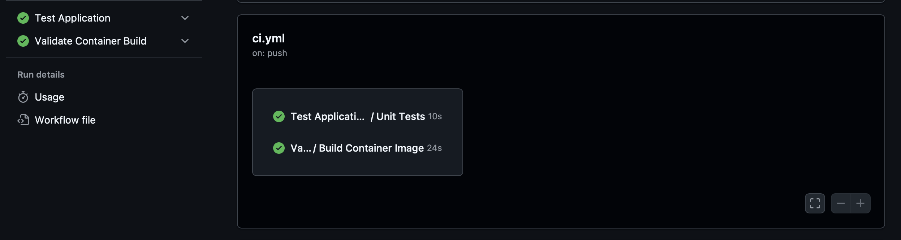
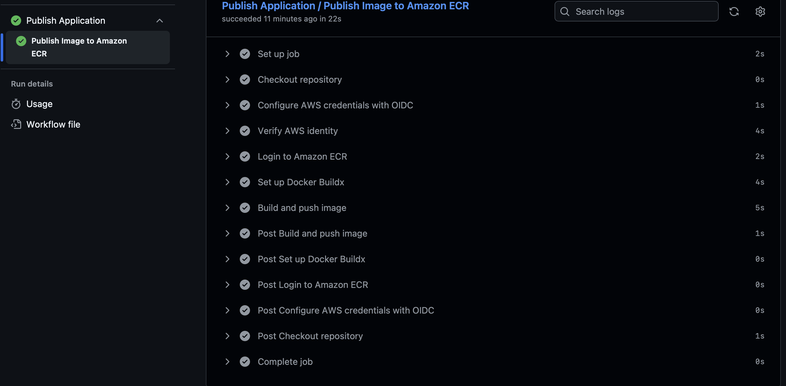
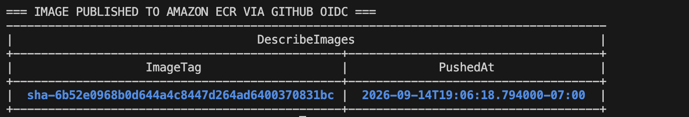
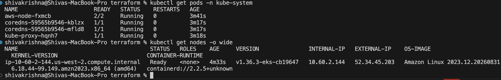
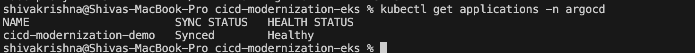
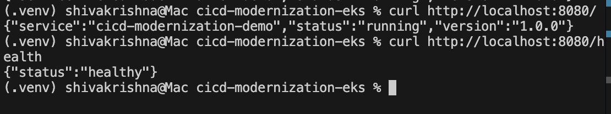

# CI/CD Modernization on AWS EKS

A hands-on CI/CD and GitOps portfolio project demonstrating a modern deployment workflow using GitHub Actions, GitHub OIDC, Amazon ECR, Amazon EKS, Terraform, Kubernetes, Kustomize, and Argo CD.

## Architecture

```text
Developer Push / Pull Request
        |
        v
GitHub Repository
        |
        v
GitHub Actions
  - Unit Tests
  - Docker Build
  - Reusable Workflows
        |
        v
GitHub OIDC
        |
        v
AWS IAM / STS
Temporary Credentials
        |
        v
Amazon ECR
        |
        v
Git Repository
Kubernetes Manifests
        |
        v
Argo CD
        |
        v
Amazon EKS
        |
        v
Kubernetes Application
```

## What This Project Demonstrates

- Modular GitHub Actions reusable workflows
- Automated Python unit testing with Pytest
- Docker image build and validation
- Passwordless GitHub-to-AWS authentication using OIDC
- Temporary AWS credentials through STS
- Least-privilege IAM permissions for ECR publishing
- Immutable SHA-tagged Docker images in Amazon ECR
- AWS infrastructure provisioning with Terraform
- Amazon EKS managed Kubernetes
- Kubernetes readiness and liveness probes
- Resource requests and limits
- Non-root container execution
- Kustomize production overlays
- GitOps deployment with Argo CD
- Automated reconciliation from Git to Kubernetes

## Technology Stack

- AWS
- Amazon EKS
- Amazon ECR
- IAM / STS
- Terraform
- GitHub Actions
- GitHub OIDC
- Docker
- Kubernetes
- Kustomize
- Argo CD
- Python
- Flask
- Gunicorn
- Pytest

## CI Pipeline

Pushes and pull requests to `main` run reusable GitHub Actions workflows for:

1. Dependency installation
2. Unit testing
3. Docker image validation

A separate publish workflow authenticates to AWS using GitHub OIDC and pushes immutable SHA-tagged container images to Amazon ECR.

No long-lived AWS access keys are stored in GitHub.

## AWS Authentication

GitHub Actions exchanges its GitHub OIDC identity for temporary AWS credentials through AWS STS.

The IAM role trust relationship is restricted to the intended GitHub repository and `main` branch.

The CI/CD role only receives permissions required to authenticate with ECR and publish container images.

## Infrastructure as Code

Terraform provisions the cloud infrastructure required for the demo, including:

- VPC
- Public subnets
- Internet gateway
- Amazon EKS cluster
- Managed EKS node group
- EKS networking and DNS add-ons
- IAM roles and policies
- GitHub OIDC provider
- Amazon ECR repository

The portfolio VPC intentionally avoids a NAT Gateway to reduce lab costs.

## Kubernetes Deployment

The application runs with two replicas and includes:

- Readiness probe
- Liveness probe
- CPU requests and limits
- Memory requests and limits
- Non-root execution
- Disabled privilege escalation

The container security context includes:

```yaml
securityContext:
  allowPrivilegeEscalation: false
  runAsNonRoot: true
  runAsUser: 1000
```

## GitOps with Argo CD

Production Kubernetes configuration is maintained under:

```text
kubernetes/
├── base/
└── overlays/
    └── prod/
```

Argo CD monitors the production Kustomize overlay and reconciles the desired state from Git into Amazon EKS.

The completed deployment reached:

```text
SYNC STATUS:   Synced
HEALTH STATUS: Healthy
```

## Application Endpoints

Main endpoint:

```text
GET /
```

Example response:

```json
{
  "service": "cicd-modernization-demo",
  "status": "running",
  "version": "1.0.0"
}
```

Health endpoint:

```text
GET /health
```

Example response:

```json
{
  "status": "healthy"
}
```

## Troubleshooting Demonstrated

During the EKS deployment, Kubernetes initially rejected the container because `runAsNonRoot` could not verify the symbolic Docker user `appuser`.

The container UID was verified:

```text
uid=1000(appuser)
```

The Kubernetes manifest was updated with:

```yaml
runAsUser: 1000
```

The fix was committed to Git, Argo CD detected the new revision, and Kubernetes created a healthy replacement ReplicaSet.

This demonstrated troubleshooting across Docker, Kubernetes security contexts, GitOps reconciliation, and Argo CD.

## Deployment Evidence

### GitHub Actions CI



### GitHub OIDC and ECR Publishing



### Amazon ECR Image



### Amazon EKS Worker Node



### Argo CD Synced and Healthy



### Running Application



## Legacy Pipeline Reference

`legacy/Jenkinsfile` represents a traditional monolithic pipeline for architectural comparison with the modular GitHub Actions and GitOps implementation.

It is included as a portfolio comparison and not as evidence of a historical production Jenkins migration.

## Repository Structure

```text
.
├── .github/
│   └── workflows/
├── app/
├── argocd/
├── kubernetes/
│   ├── base/
│   └── overlays/
│       └── prod/
├── legacy/
├── screenshots/
└── terraform/
```

## Key Outcome

The completed project demonstrates this end-to-end delivery path:

```text
Code
  ↓
GitHub Actions
  ↓
Tests and Docker Build
  ↓
GitHub OIDC
  ↓
AWS STS
  ↓
Amazon ECR
  ↓
GitOps Manifests
  ↓
Argo CD
  ↓
Amazon EKS
  ↓
Healthy Kubernetes Application
```